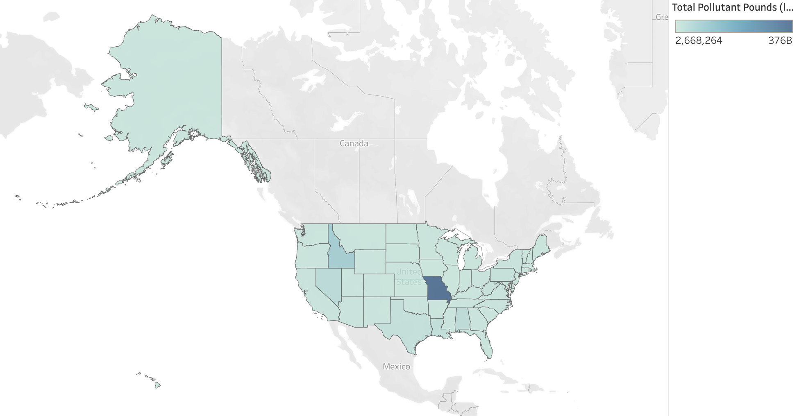

# Water Pollution Case Study

Worked on a semester-long group project within Brown's Data Science Institute sourcing, processing, analyzing, visualizing, and summarizing key results and points for our water pollution case study.

## Main Analyses

- Linear/OLS Regression

- LINE Testing

- Principal Component Analysis (PCA)

- Singular Value Decomposition (SVD)

- Anderson-Darling Test

- Durbin-Watson Test

- Breuschpagan Test

## Visualizing our results with Tableau

